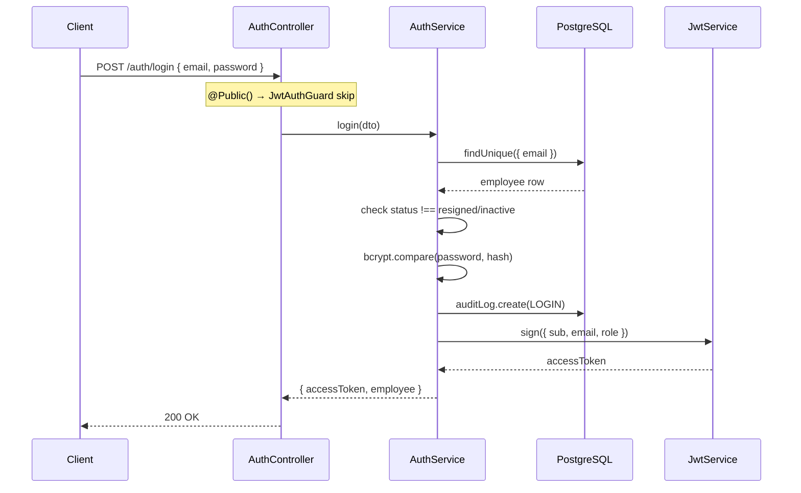
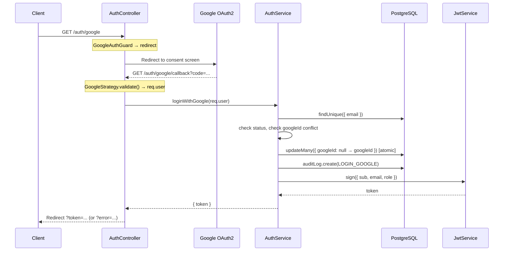

# Visual Explanation: Auth Mechanism

## Overview

Hệ thống auth của HR project dùng **JWT + Passport.js** với 2 luồng đăng nhập: Email/Password và Google OAuth2. Mọi endpoint đều được bảo vệ bởi `JwtAuthGuard` mặc định; endpoint công khai dùng decorator `@Public()` để bypass. RBAC được xử lý bởi `RolesGuard` sau khi xác thực JWT.

---

## Quick View (ASCII)

```
┌─────────────────────────────────────────────────────────────────┐
│                         CLIENT                                  │
│  Browser / Mobile App                                           │
└────────────┬────────────────────────────────┬───────────────────┘
             │  POST /auth/login              │  GET /auth/google
             │  { email, password }           │
             ▼                                ▼
┌─────────────────────────────────────────────────────────────────┐
│                    NestJS Backend (port 3000)                   │
│                                                                 │
│  ┌─────────────────┐       ┌──────────────────────────────────┐ │
│  │  JwtAuthGuard   │       │       GoogleAuthGuard            │ │
│  │  (@Public skip) │       │  (passport-google-oauth20)       │ │
│  └────────┬────────┘       └──────────────┬───────────────────┘ │
│           │                               │                     │
│           ▼                               ▼                     │
│  ┌─────────────────┐       ┌──────────────────────────────────┐ │
│  │  AuthController │       │  Google Consent Screen (OAuth2)  │ │
│  │  POST /login    │       │  → Callback /auth/google/callback│ │
│  └────────┬────────┘       └──────────────┬───────────────────┘ │
│           │                               │                     │
│           ▼                               ▼                     │
│  ┌──────────────────────────────────────────────────────────┐   │
│  │                     AuthService                          │   │
│  │  login()            loginWithGoogle()                    │   │
│  │  • bcrypt.compare   • match email in DB                  │   │
│  │  • check status     • link googleId (first time)        │   │
│  │  • AuditLog.create  • AuditLog.create                   │   │
│  │  • jwtService.sign  • jwtService.sign                   │   │
│  └────────┬────────────────────────────────────────────────┘   │
│           │                                                     │
│           ▼                                                     │
│  ┌──────────────────────────────────────────────────────────┐   │
│  │              JWT Token (signed, returned)                │   │
│  │  payload: { sub: id, email, role }                       │   │
│  └──────────────────────────────────────────────────────────┘   │
│                                                                 │
│  ────── Subsequent Requests ──────────────────────────────────  │
│                                                                 │
│  Authorization: Bearer <token>                                  │
│           │                                                     │
│           ▼                                                     │
│  ┌─────────────────┐   validate()   ┌──────────────────────┐   │
│  │  JwtAuthGuard   │ ────────────►  │    JwtStrategy       │   │
│  │  (passport-jwt) │                │  • verify signature  │   │
│  └────────┬────────┘                │  • DB lookup by sub  │   │
│           │                         │  • check status≠     │   │
│           ▼                         │    resigned/inactive  │   │
│  ┌─────────────────┐                └──────────────────────┘   │
│  │   RolesGuard    │ (optional, per-route via @Roles())        │
│  │  req.user.role  │                                           │
│  └────────┬────────┘                                           │
│           │                                                     │
│           ▼                                                     │
│  ┌─────────────────┐                                           │
│  │   Controller    │  @CurrentUser('id') injects employee id   │
│  └─────────────────┘                                           │
└─────────────────────────────────────────────────────────────────┘
```

---

## Detailed Flow

### Luồng 1: Email/Password Login



### Luồng 2: Google OAuth2 Login



### Luồng 3: Request được bảo vệ (JWT + RBAC)

```mermaid
flowchart TD
    A["Incoming Request\nAuthorization: Bearer token"] --> B{JwtAuthGuard}
    B --> C{@Public decorator?}
    C -- Yes --> G["Pass through ✓"]
    C -- No --> D["JwtStrategy.validate()"]
    D --> E{Token valid?}
    E -- No --> F["401 Unauthorized"]
    E -- Yes --> H["DB lookup employee by sub"]
    H --> I{Status check}
    I -- resigned/inactive --> J["401 Unauthorized"]
    I -- active --> K["req.user = employee"]
    K --> L{RolesGuard}
    L --> M{@Roles defined?}
    M -- No --> N["Allow ✓"]
    M -- Yes --> O{user.role in required?}
    O -- No --> P["403 Forbidden"]
    O -- Yes --> Q["Handler executes\n@CurrentUser injects id"]
```

---

## Key Concepts

1. **`@Public()` decorator** — đánh dấu endpoint bỏ qua JWT check. `JwtAuthGuard` đọc metadata qua `Reflector` để skip nếu có. Áp dụng cho `/auth/login`, `/auth/google`, `/auth/google/callback`.

2. **JWT Payload** — chỉ chứa `{ sub, email, role }`. Không lưu session server-side; mỗi request tự xác thực.

3. **JwtStrategy.validate()** — không dừng ở payload: **luôn query DB** để lấy dữ liệu mới nhất và kiểm tra status. Nếu account bị deactivate sau khi token phát hành → bị chặn ngay lập tức.

4. **Google OAuth2 Flow** — không tạo account mới. Email phải đã tồn tại trong DB. `googleId` được link atomic lần đầu (chỉ update khi `googleId IS NULL` để tránh race condition).

5. **RBAC** — `RolesGuard` đọc `@Roles()` decorator trên handler/controller, so sánh với `req.user.role` (admin | hr | manager | employee).

6. **AuditLog** — mọi LOGIN và LOGIN_GOOGLE đều được ghi vào `auditLog` table.

---

## Code Example

```typescript
// Bảo vệ endpoint + phân quyền
@Get('employees')
@Roles('admin', 'hr')          // RolesGuard check
@UseGuards(RolesGuard)
getAll(@CurrentUser('id') id: number) { ... }

// JWT payload structure (auth.service.ts:61)
const token = this.jwtService.sign({
  sub: employee.id,   // subject = employeeId
  email: employee.email,
  role: employee.role,
});

// JwtStrategy validates every request (jwt.strategy.ts:22)
async validate(payload: JwtPayload) {
  const employee = await this.prisma.employee.findUnique({ where: { id: payload.sub } });
  if (employee.status === 'resigned' || employee.status === 'inactive')
    throw new UnauthorizedException('Account is deactivated');
  return employee; // → req.user
}
```

---

## Tóm tắt luồng

| Flow | Endpoint | Guard | Kết quả |
|------|----------|-------|---------|
| Email login | `POST /auth/login` | `@Public` | JWT token + profile |
| Google login | `GET /auth/google` | `GoogleAuthGuard` | Redirect to Google |
| Google callback | `GET /auth/google/callback` | `GoogleAuthGuard` | Redirect `?token=` |
| Protected API | `GET /auth/profile` | `JwtAuthGuard` | Cần Bearer token |
| Role-based | `GET /employees` (admin) | `JwtAuthGuard + RolesGuard` | Cần role phù hợp |
| Change password | `PATCH /auth/change-password` | `JwtAuthGuard` | Cần Bearer + old pass |
